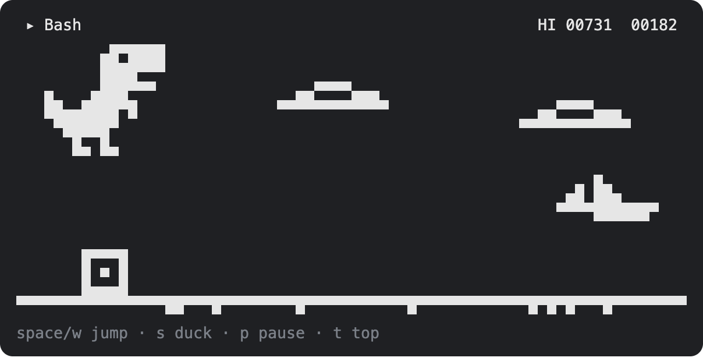

# claude-dino

A T-Rex runner you can play in a pane inside [Claude Code](https://claude.com/claude-code), inspired by Chrome's offline game.

Type `/dino`, press space, and jump the cacti while Claude works.



## Install

```sh
claude plugin marketplace add barisdemirhan/claude-dino
claude plugin install dino@claude-dino
```

Restart Claude Code, then run `/dino`.

The same two steps work from inside a session with `/plugin marketplace add barisdemirhan/claude-dino` and `/plugin install dino@claude-dino`.

## Play

| Key | Action |
| --- | --- |
| `space`, `w`, `k`, `↑` | Jump, start a run, run again after a game over, or run on after a pause |
| `s`, `j`, `↓` | Duck, or drop faster while in the air |
| `p` | Pause, and run on again |
| `t` | Show the global top over the field, between runs |
| `esc` | Give the keys back to the prompt |
| `ctrl+x` `tab` | Give the keys back to the game |

Birds show up from 150 points, the run speeds up as it goes, and night falls every 700 points. Every 100 points the score blinks. Your best score is kept between sessions and shows at the right end of the hint line under the prompt.

| Command | What it does |
| --- | --- |
| `/dino` or `/dino play` | Opens the game |
| `/dino stop` | Closes the game. The mini dino and your best score under the prompt stay |
| `/dino close` | Takes it all away, in every open session within two seconds: the game, the mini dino, your best score under the prompt and the sounds. `/dino exit` and `/dino quit` do the same. Your runs, best and settings are kept, and `/dino` brings it all back as it was |
| `/dino mini` | Turns the mini dino on: a small one that plays itself above the prompt while Claude works, hopping the cacti and ducking the birds under the clouds. `/dino mini off` turns it off. Every open session follows within two seconds, as it does for `/dino sound` and `/dino hi` |
| `/dino sound` | Turns the sounds off or on. `/dino sound on` and `/dino sound off` say which |
| `/dino hi` | Takes your best score off the line under the prompt, or puts it back. `/dino hi on` and `/dino hi off` say which |
| `/dino stats` | Your runs so far, your best and your average |
| `/dino top` | The global top ten, and where you stand if you are on it |
| `/dino name <name>` | Joins the global top under that name, or changes the name you have there. `/dino name` says whether you are on it, `/dino name off` stops the game asking |
| `/dino leave` | Takes you off the global top and deletes your runs there |

## It plays along with Claude

- **It pauses when Claude needs you.** When Claude finishes its turn or asks for a permission in the middle of a run, the run is held and a toast says why. Space runs it on.
- **Claude's work is the obstacle course.** While a run is on, every tool call Claude makes sends a crate your way, with the tool's name in the corner, and every call that fails sends a low bird. They never come closer together than the game's own obstacles do.

## The global top

The global top is a leaderboard everybody who joins shares. It is off until you join: after a lost run the keys field asks for a name, and enter joins with it. A space runs again instead, enter alone shows the board, and `/dino name off` stops the question for good. `/dino name <name>` joins at any time.

A name takes 2 to 16 letters, digits, `-` or `_`, and belongs to whoever took it first. What proves it is yours is a secret kept in the plugin's store on this machine: on another machine, or after the store is cleared, the name is taken and you need a new one.

Once you are on it, every run that beats your best there is sent by itself, and a toast says where it put you. A lost run then shows your name and your place, and one past your old best says by how much.

**Scores are not taken on trust.** The game never sends a score. It sends the seed the run started on and its moves, and the server plays the run again with the game's own rules (`hooks/sim.ts`, the same file) to see what it comes to. A made-up score, a changed rule or an edited run does not play out, and is refused.

What that cannot tell is who pressed the keys. A program that plays the real game well gets a real score. Against that the server holds back runs whose jumps are too even to be a person's until they have been looked over, takes no run longer than half an hour, and keeps every run's moves so that one can be watched and removed. Read the board as a bit of fun, not as a referee.

Two more things to know:

- Your obstacles are partly Claude's doing, so no two people run the same course.
- A run only counts under the rules it was played by. When an update changes the rules, an older plugin is told to update before its runs go up again.

## Requirements

- A Claude Code build with mod support (plugins that ship a hooks module). Built and tested on 2.1.287. Mods sit behind a rollout switch, so if `/dino` does not show up after installing, the switch may still be off for you.
- The terminal or the desktop app. Other surfaces show a notice instead of the game.
- A pane at least 30 columns wide and 8 rows tall.
- Sound needs macOS, where Claude Code has a player for it. Elsewhere the game is silent.

## What it does on your machine

The mod registers one slash command, draws one pane and, if you turn it on, one band above the prompt. It reads no files and runs no processes. It never changes a prompt, a tool call or a tool's result.

It makes no network request unless you use the global top. Then it talks to one server, `claude-dino-board.barisdemirhan.workers.dev`, through Claude Code's own `$.http.fetch`:

- `/dino top`, and `t` in the game, ask for the board. If you have joined, they send your id along to learn where you stand.
- Joining sends the name you chose, a random id and a random secret made on your machine. The secret is what makes a run yours.
- Each run that beats your best there sends its seed and its moves: when you jumped and ducked, how wide the pane was, and how many crates and birds Claude's work queued and when. The tools' names are not in it, nor anything else of your session.

The server keeps your name, your id, a hash of the secret and those runs. To slow a flood it also keeps a salted hash of the address a write came from, which later writes clear out once it is an hour old. `/dino leave` deletes your name and your runs.

The same as a privacy policy: [PRIVACY.md](PRIVACY.md).

While a run is on, it reads two things of each tool call Claude makes: the tool's name, to show it in the game, and whether the call failed. It reads nothing of the call's arguments or output, and keeps neither fact past the session.

It saves four things in the plugin's own Claude Code store: your best score, how many runs and points you have in all, your settings (sound, mini, whether your best score shows under the prompt and whether `/dino close` put it all away) and, once you join the global top, your name, id and secret there.

It plays three short sounds from its own `sounds/` folder, through Claude Code's player.

Its hooks, all in `hooks/register.tsx`:

- `session.start` registers the `/dino` command and loads your settings and best score, then passes the event on unchanged. From then on the session reads your settings from the store every two seconds, to follow what another open session switched.
- `command.run` answers only the `/dino` command. Other commands never reach it.
- `ui.render` draws only the mod's own pane, and the mini band while it is on and Claude is working. It also adds your best score after the hint line under the prompt, leaving the hint itself as it is.
- `ui.message` acts only on what the mod's own game posts: it counts finished runs, keeps the best score, plays the sounds and, if you are on the global top, sends a run that beats your best there. Any other message is passed on untouched.
- `ui.close` notes that the mod's own pane closed, and passes every close on.
- `tool.call` counts Claude's calls while a run is on, as described above, and passes each call and its result on untouched.
- `turn.complete` and `classic.Notification` pause a run that is on and show the toast: the first when Claude's turn ends, the second when Claude Code notifies you that it waits on a permission or a question. Both pass the event on unchanged and decide nothing.

The files under `tests/` run only under `claude plugin test`. They mount the pane in the test harness and are never loaded in a session.

## Develop

```sh
git clone https://github.com/barisdemirhan/claude-dino
claude plugin validate claude-dino
claude plugin test claude-dino
claude --plugin-dir claude-dino
```

The mod is five files: `hooks/register.tsx` holds the hooks, `hooks/dino.tsx` draws the game, `hooks/sim.ts` is the run's rules, `hooks/board.ts` is what the mod says to the leaderboard and `hooks/mini.tsx` is the mini dino.

### The leaderboard's server

`worker/` is a Cloudflare Worker over a D1 database. It imports `hooks/sim.ts`, so the server and the game cannot disagree on the rules. A change to how a run steps makes older runs play out differently: give `RULES` in `hooks/sim.ts` a new number and deploy the Worker with the release.

To run a board of your own:

```sh
cd worker
wrangler d1 create claude-dino-board     # put the id it prints in wrangler.toml
wrangler d1 migrations apply claude-dino-board --remote
wrangler deploy
wrangler secret put ADMIN_TOKEN          # any long random string
```

Then point `BOARD` in `hooks/board.ts` at your Worker's address.

The keeper's routes take `Authorization: Bearer <ADMIN_TOKEN>`:

| Route | What it does |
| --- | --- |
| `GET /admin/flagged` | The runs held back as too even to be a person's |
| `POST /admin/clear` `{"run": 12}` | Counts a held run after all |
| `POST /admin/ban` `{"name": "x"}` | Takes a player off the board and refuses their runs; `"banned": false` undoes it |
| `POST /admin/remove` `{"name": "x"}` | Deletes a player and their runs |

## License

MIT
